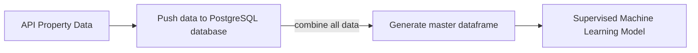

# Final Project - Group 2

## Team & Roles

| Team Member |      Role       |
| ---         |             --- |
| Kinsler, Nick   | Database & Visual Storytelling |
| Mesfin, Mia     | Visual Storytelling            |
| Lilburn, Sam    | Database                       |
| Marone, Michael | Machine Learning               |

## Data and Code Used

[API_Call_Henrico](https://github.com/samlilburn07/Final_Project/blob/main/Henrico%20API.ipynb)

[API_Call_Chesterfield](https://github.com/samlilburn07/Final_Project/blob/main/Chesterfield_%20API.ipynb)

[API_Call_Hanover](https://github.com/samlilburn07/Final_Project/blob/main/Hanover_%20API.ipynb)

[API_Call_Richmond](https://github.com/samlilburn07/Final_Project/blob/main/Richmond_%20API.ipynb)

[CSV_Files](https://github.com/samlilburn07/Final_Project/blob/main/CSV.zip)

[Database]()

[ML_Model]()

## Dashboard

[Dashboard]()

[Slides](https://docs.google.com/presentation/d/1JI7ge-d46_nkuULEKxNPUVLMTKXlU44sqY1PGESOaps/edit#slide=id.p)

# Week 3 (Data Gathering, Database, and ML Model)

## Topic: What is good market rate to list a home for sale in the Greater Richmond area?

### Data Gathering

Utilizing the API offered by Realty Mole (https://rapidapi.com/realtymole/api/realty-mole-property-api) we were able to run all the zip codes for the major counties in and around the City of Richmond.  The counties include: City of Richmond, Chesterfield, Henrico, and Hanover.  These counties account for 74 zip codes.  The following zip codes did not have any sale listing data available:

| County | Zipcode |
| --- | --- |
| City of Richmond | 23284, 23298, 23240, 23218, 23232, 23241, 23249, 23261, 23269, 23274, 23278, 23285, 23286, 23290, 23289, 23292, 23291, 23293 |
| Chesterfield | 23297, 23806 |
| Hanover | N/A |
| Henrico | 23173, 23058, 23255, 23250, 23273, 23279, 23282, 23280, 23288 |

### Machine Learning Model

To predict listing prices of properties in the Greater Richmond Area, we are utilizing a supervised machine learning model, specifically linear regression. The use of a linear regression model will allow us to predict a continuous value based on our selected independent variables (Zip Code, Property Type, Sq. Footage, Number of Bedrooms, and Number of Bathrooms). To allow us to include discrete variables, such as Property type, we encoded the data using ```pandas.get_dummies()``` to generate columns with binary classification for a property type as 0 (if not the correct property type for that datapoint) or 1 (if the correct property type for that data point). Since our dataset already has the listing prices, we have fit a supervised machine learning model to a part of our original dataset to train our model and then run each property through our model to predict its listed price. For our machine learning model setup, we split our data into training and testing sets with 80% of data in the training set and 20% in the testing set. The random state values was set to 1 so that any subsequent runs of this model on our dataset will reproduce the results by using the same random state.

After training our model on our training data and predicting the listing prices for the test data, we applied our linear regression model to our whole dataset to predict the price of each property listing and adding it to our dataframe for side by side comparision. 

<table>
<tr>
<th>Code</th>
<th>Model Statistics</th>
</tr>
<tr>
<td>
  
```
# Calculate model statistics

print(f"r-squared: {model.score(X,y).round(decimals=2)}")
print(f"Adjusted r-squared: {(1 - (1-model.score(X, y))*(len(y)-1)/
	(len(y)-X.shape[1]-1)).round(decimals=2)}")
print(f"Coefficients: {(model.coef_).round(decimals=2)}")
print(f"y-intercept: {(model.intercept_).round(decimals=2)}")
```

</td>
<td>

```
r-squared: 0.8
Adjusted r-squared: 0.79
Coefficients: [[ 0.000000e+00  7.000000e-02  1.899100e+02 
		-5.125930e+04  8.354012e+04 4.800230e+03  
		4.294047e+04 -4.774070e+04]]
y-intercept: [-65013.33]
```

</td>
</tr>
</table>


# Week 2 (Refining Topic and Data Gathering)

## Current Topic: Real Estate

### The Answer We Want 

If given the data of a residential piece of real estate in the Greater Richmond Area (square footage, location, and the other data categories we are analyzing), we hope to answer the question "what is a fair price to list this home?" This would allow sellers and buyers to make competitive listings and bids on homes. Additionally, it would allow us to identify listings that are above and below market value. 

### Reason for switching topics:

Our topic is the residential real estate market. Originally, our topic was predicting employee burnout. We were interested in this topic because of current conversation around workplace burnout and "quite quitting." Specifically, we hoped to find if we could predict the probability of an employee quitting based on key factors. We found data on this topic to be scarce and inconsistent. After this discovery, we pivoted to analysis of the real estate market. This topic is also highly relevant, and unlike employee attrition rates, has widely available data.

Further investigation confirmed that researching the real estate market eliminates our previous problems of small datasets and accessible data. We found plenty of information on property records, current sale listings, and property value estimates from https://rapidapi.com/realtymole/api/realty-mole-property-api. We will be using the Realty Mole Property API to collect current residential property sale listings in the Greater Richmond Area. Converting that information and storing it in PostSQL we will then use Supervised Machine Learning to predict the listing and R to create an optimal range for the listing. Knowing the optimal listing for a residential property sale will inform both buyers and sellers on the fairness and competitiveness of their listings and offers. A summary of our work on the original topic of workplace burnout can be found below the following description of our residential real estate market research.

### Database & Workflow

We will be using the Realty Mole Property API to collect current Property Sale listings of the Greater Richmond area. Converting that information and storing it in PostSQL we will then use Supervised Machine Learning to predict the listing and R to create an optimal range for the listing.

We plan to use the https://rapidapi.com/realtymole/api/realty-mole-property-api API to request 500 active listings from each of the displayed zip codes. All zip codes will not have 500 active listings, so we do not yet know how large our data set will be. Once completing calls for each zip code, we will combine them into a PostgreSQL database using SQLAlchemy. Next, we will use SQLAlchemy to create a dataframe from the compiled data. This data frame can be further manipulated using pandas and will be ready for machine learning and R analysis.

We plan to use the Rapid API to request 500 active listings from each of the zip codes displayed in our **Property Listing Zip Codes Used** chart. All zip codes will not have 500 active listings, so we do not yet know how large our data set will be. Once completing calls for each zip code, we will combine the active listing data into a PostgreSQL database using SQLAlchemy. We will again use SQLAlchemy to create a data frame from the compiled data in the PostreSQL database. This data frame can be further manipulated using Pandas and will be ready for machine learning and R analysis. This workflow is visualized in the below workflow chart. 



### API Active Listing Data Requests

Below is an example of an API request for one of the zip codes within our region of analysis.

<table>
<tr>
<th>Code</th>
<th>JSON Output</th>
</tr>
<tr>
<td>
  
```
url = "https://realty-mole-property-api.p.rapidapi.com/saleListings"

querystring = {"zipCode":"23233","limit":"500"}

headers = {
	"X-RapidAPI-Key": "YOUR-KEY-HERE",
	"X-RapidAPI-Host": "realty-mole-property-api.p.rapidapi.com"
}

response = requests.request("GET", url, headers=headers, params=querystring).json()

print(json.dumps(response, indent=4, sort_keys=True))
```

</td>
<td>

```json
{
        "addressLine1": "10121 Ridgefield",
        "bedrooms": 0,
        "city": "Richmond",
        "county": "Henrico County",
        "createdDate": "2022-01-18T09:39:12.536Z",
        "daysOnMarket": 302,
        "formattedAddress": "10121 Ridgefield, Richmond, VA 23233",
        "id": "10121-Ridgefield,-Richmond,-VA-23233",
        "lastSeen": "2022-11-15T12:27:11.426Z",
        "latitude": 37.624574,
        "listedDate": "2022-01-17T16:35:55.000Z",
        "longitude": -77.598804,
        "lotSize": 80107,
        "price": 310000,
        "propertyType": "Land",
        "removedDate": null,
        "state": "VA",
        "status": "Active",
        "zipCode": "23233"
}
```

</td>
</tr>
</table>
 
### Property Listing Zip Codes Used

| County | Zipcode |
| --- | --- |
| Henrico | 23233, 23060, 23231, 23228, 23229, 23238, 23294, 23150, 23075, 23058, 23242, 23255, 23250, 23273, 23279, 23282, 23280, 23288 |
| Henrico/City of Richmond | 23223, 23227, 23222, 23226, 23230, 23173 |
| Henrico/Hanover | 23059 |
| Chesterfield     | 23112, 23803, 23832, 23831, 23834, 23237, 23113, 23236, 23114, 23838, 23836, 23120, 23297, 23806 |
| Chesterfiled/City of Richmond | 23234, 23225, 23235 |
| Hanover          | 23111, 23116, 23005, 23192, 23015, 23069, 23146, 23047, 23162 |
| City of Richmond | 23224, 23220, 23221, 23219, 23284, 23298, 23240, 23218, 23232, 23241, 23249, 23261, 23260, 23269, 23274, 23278, 23285, 23286, 23290, 23289, 23292, 23291, 23293 |

### Visualizations 

We anticipate using Tableau for the story telling portion of the project. We have two heatmaps planned to illustrate our data. The first is a heatmap showing the areas with the highest listed prices. The second is a heatmap visualizing the areas where listings have the shortest time on the market. We believe these visualizations will combine to represent the "hottest" real estate markets in the Greater Richmond Area.

# Week 1 (Picking a Topic and Finding Data)

## Original Topic: Employee Attrition

### Objective

Can we predict the likelihood of an employee quitting?

### Machine Learning

Based on the data we have access to, we believe the use of an unsupervised model would be best as the outcome is not known.

[HR_Code](https://github.com/samlilburn07/Final_Project/blob/main/ProjectData_Preprocessing.ipynb)

### Database

We planned on utilizing PostSQL for our database.  The data would be cleaned prior to importing into Post SQL.  The CSV file(s) would run through Python utilizing Jupyter Notebook.  The cleaned file would be exported to a new CSV file.

### Visualizations

We anticipate using Tableau for the story telling portion of the project.  We would graph out comparisons of the data based on the survey responses compared to demographical information.  Demographical information we planned to use:

- Gender

- Company type

- WFH (Work from Home)

- Designation

- Other items

### Data

https://www.kaggle.com/datasets/blurredmachine/are-your-employees-burning-out

| Demographic Information |      Survey Responses       |
| ---                     |                         --- |
| <li>**Employee Id:** Unique id for survey participant</li><li>**Date Joined:** Date hired by company</li><li>**Gender:** Male, Female, on Unknown</li><li>**Company Type:** Designated between service oriented and product oriented</li></li><li>**WFH Setup Available:** Yes, allowed for work from home</li><li>**Designation:** 1 to 5 with 1 being lower status and 5 being highest status</li>  | <li>**Resource Allocation:** 1 low resource available and 10 means high number of resources available</li><li>**Mental Fatigue Score:** 0 means no fatigue and 10 means completely fatigue</li><li>**Burn Rate:** 0 to 100 with 100 being highest level of burnout</li> |

### Reason for switching topics:

During our data procurement phase, we determined the availability of certain data was difficult to find/access.  The model we wanted to create (determining the likelihood of an employee quitting) was difficult to run without making significant assumptions in the absence of readily available data.
