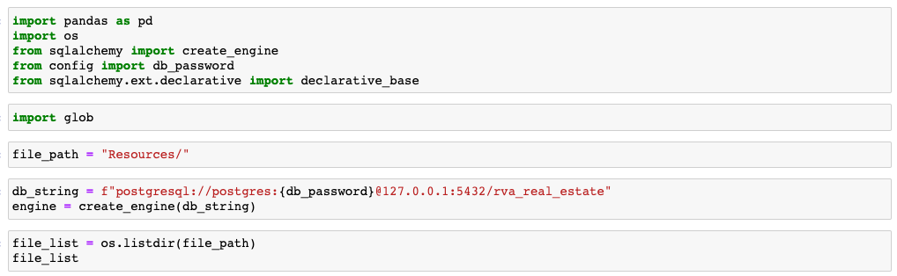
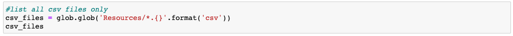
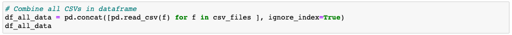
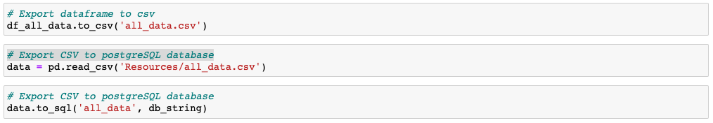
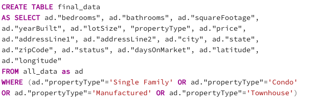
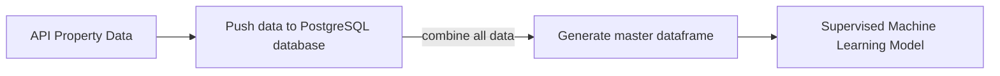

# Final Project - Group 2

## Team & Roles

| Team Member |      Role       |
| ---         |             --- |
| Kinsler, Nick   | Data Analysis |
| Mesfin, Mia     | Visual Storytelling            |
| Lilburn, Sam    | Database                       |
| Marone, Michael | Machine Learning               |

## Data and Code Used

[API_Call_Henrico](https://github.com/samlilburn07/Final_Project/blob/main/Henrico%20API.ipynb)

[API_Call_Chesterfield](https://github.com/samlilburn07/Final_Project/blob/main/Chesterfield_%20API.ipynb)

[API_Call_Hanover](https://github.com/samlilburn07/Final_Project/blob/main/Hanover_%20API.ipynb)

[API_Call_Richmond](https://github.com/samlilburn07/Final_Project/blob/main/Richmond_%20API.ipynb)

[CSV_Files](https://github.com/samlilburn07/Final_Project/blob/main/CSV.zip)

[Database]()

[ML_Model]()

## Dashboard

[Dashboard]()

[Slides](https://docs.google.com/presentation/d/1JI7ge-d46_nkuULEKxNPUVLMTKXlU44sqY1PGESOaps/edit#slide=id.p)

# Week 4 (Database Compiling, ML Model Finalization, and Visualizations)

## Database

To import our data into postgresSQL, we used Python, Pandas and SQLAlchemy. Each csv file for the 74 correlating zip codes for which an API call was made is stored in a folder named “Resources.” The code used to create a file path, create the database engine, and list the files can be seen below. 



We then used glob to pull only the csv files from our resource folder, as seen below. 



After compiling the csv files, a for loop was used to combine them into a data frame as seen below. 



Once all the data was in a pandas data frame, we exported the data frame into postgresSQL using the below code.



After importing the data into our database, rva_real_estate, we confirmed all rows transferred using “SELECT COUNT(*) FROM all_data.” Once confirming all our data transferred, we used a SQL query to create a table named final_data. We also used a WHERE statement to filter the property types to “Single Family,” Condo,” Manufactured,” and “Townhouse.” We excluded the “Land” and “Apartment” property types because the API we called uses the “Apartment” property type when referring to rentals and we wanted to analyze housing prices, not land prices. The code for our postresSQL query is below. 



The final_data table created by this query was exported into a csv and distributed to the team. 

### Machine Learning Model Finalization

Once the master data frame of all properties in the greater Richmond area were compiled in PostgreSQL, this CSV was imported into Jupyter Notebook for preprocessing. k

#### Data frame of all properties in the Greater Richmond Area


Initially running our model we included the independent variables Zip Code, Lot Size, Property Type, Sq. Ft., Bedrooms, and Bathrooms, alongside dependent variable Price. We adjusted the model several times by including and removing variables and adjusting the price cutoff for properties. We decided to include a price cutoff for properties as higher listed homes lost its linearity with their predictions when greater than ~ $1.0 million. Removing the homes with a greater than $1.0 million listings also greatly reduced the error of predictions.

| No Price Cutoff | $1.0 Million Cutoff |
| ---------------------------- | ---------------------------- |
| | |

In trying to maximize the r-squared value of our model, we looked to which variables were most important. When initially running the model with all of our desired independent variables (Zip Code, Lot Size, Property Type, Sq. Ft., Bedrooms, and Bathrooms), we found that Zip Code and Lot Size show a low correlation with Price and our model shows an r-squared of 0.71. Additionally, approx. 10,000 properties of our ~16,000 property listings had missing values for lot size, decreasing our dataset numbers drastically. Due to this, and its low correlation to Price and it removing a large portion of our workable data, we decided to remove this variable from our model.

#### Correlation matrix of independent and dependent variables


Running our final model with Zip Code, Lot Size, Property Type, Sq. Ft., Bedrooms, and Bathrooms to predict listing Price, our model had an r-squared of 0.71 with its lowest error of all runs with a Root Mean Squared Error of $88583.

<table>
<tr>
<th>Model Statistics</th>
<th>Error Calculations</th>
</tr>
<tr>
<td>

```
r-squared: 0.71
Adjusted r-squared: 0.71
Coefficients: [[   -66.02    139.64 -22117.19  39963.58  14029.78 -59941.83  24807.58
   21104.47]]
y-intercept: [1585098.27]
```

</td>
<td>

```

Mean Squared Error: 7846950377.396699
Root Mean Squared Error: 88583.01404556462
Absolute Mean Error: 62366.79768203578
```

</td>
</tr>
</table>

### Dashboard

The graphs were created on Tableau Public using the data collected from Real Estate API of current listings in the Greater Richmond Area. 


The first graph is a Heat map of the average prices grouped by Zip Code. This will illustrate price differences by location. To eliminate outliers, we applied a limit on the listing price. Listings above $80,000 and below $2,500,000 were included. From the total data collected, the average cost was roughly $400,000 which we selected as the median for the Heat map. To create this Heat map we placed two marks, differentiating the Price by color and adding Zip Code to the detail.


Comparing the average Price by Property Type from all listings was very illuminating. 

- Manufactured houses averaged $163,483, 
- Condo homes averaged $333,938,
- Townhouses averaged $372,500,
- Single Family homes 403, 045 

We found that the median house listing in Greater Virginia was $393,461. 

According to [Virginia REALTORS](https://virginiarealtors.org/research/reports/home-sales-reports/october-2022-home-sales-report/), the median house sale price in Virginia in October was $365,000. 

According to [Federal Reserve Economic Data](https://fred.stlouisfed.org/series/MSPUS), the median price of houses sold in 2022 in the United States was $428,700. 

Set side by side, Greater Virginia is becoming a very expensive place to live compared to the rest of Virginia. 
Luckily, Greater Virginia is cheaper in regards to the rest of the country, but an expensive location when compared to Virginia. 


Further analysis on Price and Zip code was needed. Here we highlight all Zip Code's with a reported average of $500,00 or higher. 


Here we really see the magnitude of property types grouped by Zip Code. It's clear to see that in Greater Virginia the majority of listings are Single Family houses. In most Zip Codes, condos are the second leading property type on the market, and townhouses are a third with manufactured in the last. 


This pie chart further illustrates the quantity of houses by Property Type. Out of the total 16,511 listings 84%. Condos make up 12% and Townhouses are 4% of total listings. There were only 6 listings of Manufactured houses. 


# Week 3 (Data Gathering, Database, and ML Model)

## Topic: What is good market rate to list a home for sale in the Greater Richmond area?

### Data Gathering

Utilizing the API offered by Realty Mole (https://rapidapi.com/realtymole/api/realty-mole-property-api) we were able to run all the zip codes for the major counties in and around the City of Richmond.  The counties include: City of Richmond, Chesterfield, Henrico, and Hanover.  These counties account for 74 zip codes.  The following zip codes did not have any sale listing data available:

| County | Zipcode |
| --- | --- |
| City of Richmond | 23284, 23298, 23240, 23218, 23232, 23241, 23249, 23261, 23269, 23274, 23278, 23285, 23286, 23290, 23289, 23292, 23291, 23293 |
| Chesterfield | 23297, 23806 |
| Hanover | N/A |
| Henrico | 23173, 23058, 23255, 23250, 23273, 23279, 23282, 23280, 23288 |

The code used to generate the real estate data is as follows:

!

Utilized pandas, requests, and json in python via Jupyter Notebook to run the realty mole API.  The code was ran using each zip code in the Greater Richmond area and limited to 500 results based on the terms of the API.

!

!

After running for each zip code, a data frame was created for each zip code.

!

Ran dtypes on the data frame in order to have the object types available for the creation of the database and machine learning model.

!

Imported each data frame to a CSV file to be used for the database.

### Database

Our database in postreSQL contains 46 tables with identical columns. There is a table for each zip code in the greater Richmond area. The data was imported to the postgresSQL database using SQLAlchemy. We plan to compile all data from the “bedrooms,” “bathrooms,” “squareFootage,” “yearBuilt,” “lotSize,” “propertyType,” “price,” “addressLine1”,” city,” “state,” “zipCode,” “status,” “daysOnMarket,” “latitude”, “longitude,” and “addressLine2” columns using a SQL query. The other columns provided by the API were deemed unnecessary for our analysis. This compiled data will be used for our visualizations and regression analysis.

### Machine Learning Model

To predict listing prices of properties in the Greater Richmond Area, we are utilizing a supervised machine learning model, specifically linear regression. To generate and preview our full model, we ran data from the zip code 23112 only to ensure our code and model are running properly. The use of a linear regression model will allow us to predict a continuous value based on our selected independent variables (Zip Code, Property Type, Sq. Footage, Number of Bedrooms, and Number of Bathrooms). 

| Data frame X-values (preview) | Data frame y-values (preview) |
| ---------------------------- | ---------------------------- |
| |  |

To allow us to include discrete variables, such as Property type, we encoded the data using ```pandas.get_dummies()``` to generate columns with binary classification for a property type as 0 (if not the correct property type for that datapoint) or 1 (if the correct property type for that data point). Since our dataset already has the listing prices, we have fit a supervised machine learning model to a part of our original dataset to train our model and then run each property through our model to predict its listed price. For our machine learning model setup, we split our data into training and testing sets with 80% of data in the training set and 20% in the testing set. The random state values were set to 0 so that any subsequent runs of this model on our dataset will reproduce the results by using the same random state.

#### Splitting the data into training and testing setse

```
# Split the data into training and testing dataset

from sklearn.model_selection import train_test_split

X_train, X_test, y_train, y_test = train_test_split(X,y,test_size=0.2,random_state = 0)
```

After training our model on our training data and predicting the listing prices for the test data, we applied our linear regression model to our whole dataset to predict the price of each property listing and adding it to our data frame for side by side comparison. 

#### Final dataset including predicted prices for each property in area code 23112


<table>
<tr>
<th>Code</th>
<th>Model Statistics</th>
</tr>
<tr>
<td>
  
```
# Calculate model statistics

print(f"r-squared: {model.score(X,y).round(decimals=2)}")
print(f"Adjusted r-squared: {(1 - (1-model.score(X, y))*(len(y)-1)/
	(len(y)-X.shape[1]-1)).round(decimals=2)}")
print(f"Coefficients: {(model.coef_).round(decimals=2)}")
print(f"y-intercept: {(model.intercept_).round(decimals=2)}")
```

</td>
<td>

```
r-squared: 0.8
Adjusted r-squared: 0.79
Coefficients: [[ 0.000000e+00  7.000000e-02  1.899100e+02 
		-5.125930e+04  8.354012e+04 4.800230e+03  
		4.294047e+04 -4.774070e+04]]
y-intercept: [-65013.33]
```

</td>
</tr>
</table>

### Dashboard 

We will be using Tableau Public to create the final dashboard. We will also be using D3 for anyone to filter through our data in a user-friendly way. 

# Week 2 (Refining Topic and Data Gathering)

## Current Topic: Real Estate

### The Answer We Want 

If given the data of a residential piece of real estate in the Greater Richmond Area (square footage, location, and the other data categories we are analyzing), we hope to answer the question "what is a good market rate price to list a home?" This would allow sellers and buyers to make competitive listings and bids on homes. Additionally, it would allow us to identify listings that are above and below market value. 

### Reason for Switching Topics

Our topic is the residential real estate market. Originally, our topic was predicting employee burnout. We were interested in this topic because of current conversation around workplace burnout and "quite quitting." Specifically, we hoped to find if we could predict the probability of an employee quitting based on key factors. We found data on this topic to be scarce and inconsistent. After this discovery, we pivoted to analysis of the real estate market. This topic is also highly relevant, and unlike employee attrition rates, has widely available data.

Further investigation confirmed that researching the real estate market eliminates our previous problems of small datasets and accessible data. We found plenty of information on property records, current sale listings, and property value estimates from https://rapidapi.com/realtymole/api/realty-mole-property-api. We will be using the Realty Mole Property API to collect current residential property sale listings in the Greater Richmond Area. Converting that information and storing it in PostSQL we will then use Supervised Machine Learning to predict the listing and R to create an optimal range for the listing. Knowing the optimal listing for a residential property sale will inform both buyers and sellers on the fairness and competitiveness of their listings and offers. A summary of our work on the original topic of workplace burnout can be found below the following description of our residential real estate market research.

### Database & Workflow

We will be using the Realty Mole Property API to collect current Property Sale listings of the Greater Richmond area. Converting that information and storing it in PostSQL we will then use Supervised Machine Learning to predict the listing and R to create an optimal range for the listing.

We plan to use the https://rapidapi.com/realtymole/api/realty-mole-property-api API to request 500 active listings from each of the displayed zip codes. All zip codes will not have 500 active listings, so we do not yet know how large our data set will be. Once completing calls for each zip code, we will combine them into a PostgreSQL database using SQLAlchemy. Next, we will use SQLAlchemy to create a data frame from the compiled data. This data frame can be further manipulated using pandas and will be ready for machine learning and R analysis.

We plan to use the Rapid API to request 500 active listings from each of the zip codes displayed in our **Property Listing Zip Codes Used** chart. All zip codes will not have 500 active listings, so we do not yet know how large our data set will be. Once completing calls for each zip code, we will combine the active listing data into a PostgreSQL database using SQLAlchemy. We will again use SQLAlchemy to create a data frame from the compiled data in the PostreSQL database. This data frame can be further manipulated using Pandas and will be ready for machine learning and R analysis. This workflow is visualized in the below workflow chart. 



### API Active Listing Data Requests

Below is an example of an API request for one of the zip codes within our region of analysis.

<table>
<tr>
<th>Code</th>
<th>JSON Output</th>
</tr>
<tr>
<td>
  
```
url = "https://realty-mole-property-api.p.rapidapi.com/saleListings"

querystring = {"zipCode":"23233","limit":"500"}

headers = {
	"X-RapidAPI-Key": "YOUR-KEY-HERE",
	"X-RapidAPI-Host": "realty-mole-property-api.p.rapidapi.com"
}

response = requests.request("GET", url, headers=headers, params=querystring).json()

print(json.dumps(response, indent=4, sort_keys=True))
```

</td>
<td>

```json
{
        "addressLine1": "10121 Ridgefield",
        "bedrooms": 0,
        "city": "Richmond",
        "county": "Henrico County",
        "createdDate": "2022-01-18T09:39:12.536Z",
        "daysOnMarket": 302,
        "formattedAddress": "10121 Ridgefield, Richmond, VA 23233",
        "id": "10121-Ridgefield,-Richmond,-VA-23233",
        "lastSeen": "2022-11-15T12:27:11.426Z",
        "latitude": 37.624574,
        "listedDate": "2022-01-17T16:35:55.000Z",
        "longitude": -77.598804,
        "lotSize": 80107,
        "price": 310000,
        "propertyType": "Land",
        "removedDate": null,
        "state": "VA",
        "status": "Active",
        "zipCode": "23233"
}
```

</td>
</tr>
</table>
 
### Property Listing Zip Codes Used

| County | Zipcode |
| --- | --- |
| Henrico | 23233, 23060, 23231, 23228, 23229, 23238, 23294, 23150, 23075, 23058, 23242, 23255, 23250, 23273, 23279, 23282, 23280, 23288 |
| Henrico/City of Richmond | 23223, 23227, 23222, 23226, 23230, 23173 |
| Henrico/Hanover | 23059 |
| Chesterfield     | 23112, 23803, 23832, 23831, 23834, 23237, 23113, 23236, 23114, 23838, 23836, 23120, 23297, 23806 |
| Chesterfield/City of Richmond | 23234, 23225, 23235 |
| Hanover          | 23111, 23116, 23005, 23192, 23015, 23069, 23146, 23047, 23162 |
| City of Richmond | 23224, 23220, 23221, 23219, 23284, 23298, 23240, 23218, 23232, 23241, 23249, 23261, 23260, 23269, 23274, 23278, 23285, 23286, 23290, 23289, 23292, 23291, 23293 |

### Visualizations 

We anticipate using Tableau for the story telling portion of the project. We have two heatmaps planned to illustrate our data. The first is a heatmap showing the areas with the highest listed prices. The second is a heatmap visualizing the areas where listings have the shortest time on the market. We believe these visualizations will combine to represent the "hottest" real estate markets in the Greater Richmond Area.

# Week 1 (Picking a Topic and Finding Data)

## Original Topic: Employee Attrition

### Objective

Can we predict the likelihood of an employee quitting?

### Machine Learning

Based on the data we have access to, we believe the use of an unsupervised model would be best as the outcome is not known.

[HR_Code](https://github.com/samlilburn07/Final_Project/blob/main/ProjectData_Preprocessing.ipynb)

### Database

We planned on utilizing PostSQL for our database.  The data would be cleaned prior to importing into Post SQL.  The CSV file(s) would run through Python utilizing Jupyter Notebook.  The cleaned file would be exported to a new CSV file.

### Visualizations

We anticipate using Tableau for the story telling portion of the project.  We would graph out comparisons of the data based on the survey responses compared to demographical information.  Demographical information we planned to use:

- Gender

- Company type

- WFH (Work from Home)

- Designation

- Other items

### Data

https://www.kaggle.com/datasets/blurredmachine/are-your-employees-burning-out

| Demographic Information |      Survey Responses       |
| ---                     |                         --- |
| <li>**Employee Id:** Unique id for survey participant</li><li>**Date Joined:** Date hired by company</li><li>**Gender:** Male, Female, on Unknown</li><li>**Company Type:** Designated between service oriented and product oriented</li></li><li>**WFH Setup Available:** Yes, allowed for work from home</li><li>**Designation:** 1 to 5 with 1 being lower status and 5 being highest status</li>  | <li>**Resource Allocation:** 1 low resource available and 10 means high number of resources available</li><li>**Mental Fatigue Score:** 0 means no fatigue and 10 means completely fatigue</li><li>**Burn Rate:** 0 to 100 with 100 being highest level of burnout</li> |

### Reason for switching topics:

During our data procurement phase, we determined the availability of certain data was difficult to find/access.  The model we wanted to create (determining the likelihood of an employee quitting) was difficult to run without making significant assumptions in the absence of readily available data.
